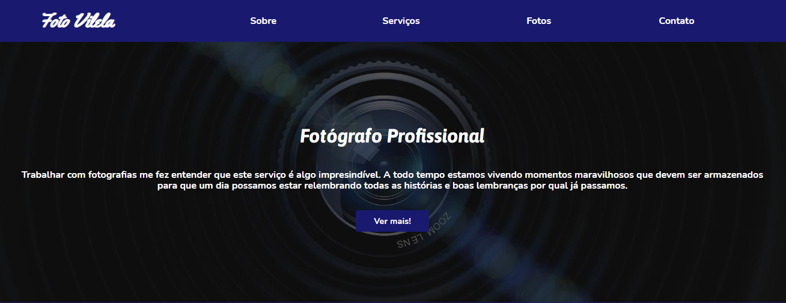

<h1 align="center">Foto Vilela</h1>

   <h2 align="center">Tópicos 📋</h2>

   <p>
   
   - [Sobre 📖](#sobre-)
   - [Layout 🖥️](#layout-)
   - [Funcionalidades 🛠️](#funcionalidades-%EF%B8%8F)
   - [Tecnologias 📲](#tecnologias-)
   - [Como utilizar 🤔](#como-utilizar-)

   </p>

---

<h2 align="center">Sobre 📖</h2>
   
<p align="center">
  Buscando preencher a necessidade de uma maneira fácil de encontrar o estúdio de fotografia, o site foi desenvolvido com o intuito de ser a principal maneira de encontrar
  os contatos do mesmo. 
</p>

---

<h2 align="center"> 
	✔️  Foto Vilela 🏁 Finalizado!  ✔️
</h2>

<h2 align="center">Layout 📱</h2>

  
	
	
	
	
---

<h2 align="center">Funcionalidades 🛠️</h2>

   <p>

- Ver informações sobre o estúdio
- Ver todos os serviços prestados pelo profissional
- Ver os contatos disponíveis para contratar
- Ver alguns de seus trabalhos

   </p>

---

<h2 align="center">Tecnologias 📲</h2>

   <p>
	As seguintes ferramentas foram usadas na construção do projeto:

	- [Html](https://developer.mozilla.org/pt-BR/docs/Web/HTML)
	- [Node.js](https://www.w3schools.com/css/)

   </p>

---

<h2 align="center">Como utilizar 🤔</h2>

   ### Pré-requisitos

   Antes de começar, você vai precisar ter instalado em sua máquina as seguintes ferramentas:
   [Git](https://git-scm.com). 
   Além disto é bom ter um editor para trabalhar com o código como [VSCode](https://code.visualstudio.com/)

   ```
   - Clone este repositório:
   $ git clone https://github.com/icarogga/fotoVilela.git

   Depois é só abrir o arquivo index.html em seu navegador de preferência 😉
   ```

---

## 💪 Como contribuir para o projeto

1. Faça um **fork** do projeto.
2. Crie uma nova branch com as suas alterações: `git checkout -b my-feature`
3. Salve as alterações e crie uma mensagem de commit contando o que você fez: `git commit -m "feature: My new feature"`
4. Envie as suas alterações: `git push origin my-feature`
> Caso tenha alguma dúvida confira este [guia de como contribuir no GitHub](./CONTRIBUTING.md)

---

   ## 🦸 Autor

   Este projeto foi desenvolvido com o ❤️ por **[@Ícaro Coêlho](https://github.com/icarogga?tab=following)** 👋🏽 Entre em contato!
   
   [](https://www.linkedin.com/in/ícaro-coelho-3a5b60206/) 
[](mailto:icarogga@gmail.com)

---

## 📝 Licença

Este projeto esta sobe a licença [MIT](./LICENSE).


---
