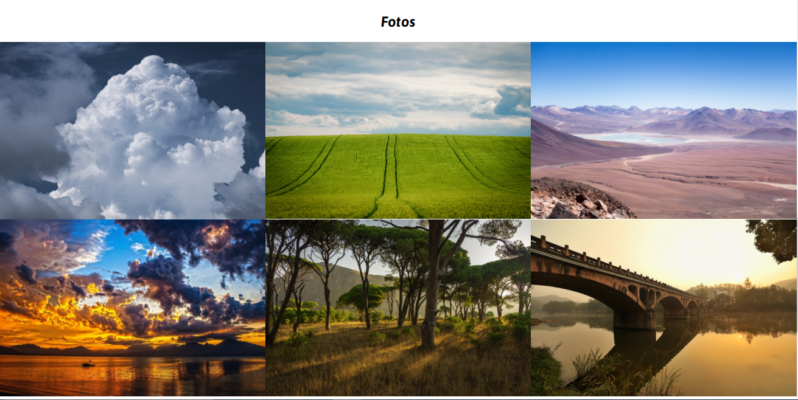

<h1 align="center">Foto Vilela</h1>

   <h2 align="center">Tópicos 📋</h2>

   <p>
   
   - [Sobre 📖](#sobre-)
   - [Preview 📱](#preview-)
   - [Funcionalidades 🛠️](#funcionalidades-%EF%B8%8F)
   - [Como utilizar 🤔](#como-utilizar-)

   </p>

---

<h2 align="center">Sobre 📖</h2>
   
<p align="center">
  Buscando preencher a necessidade de uma maneira fácil de encontrar o estúdio de fotografia, o site foi desenvolvido com o intuito de ser a principal maneira de encontrar
  os contatos do mesmo. 
</p>

---

<h2 align="center">Preview 📱</h2>

  
	
	
	
---

<h2 align="center">Funcionalidades 🛠️</h2>

   <p>

- Ver informações sobre o estúdio
- Ver todos os serviços prestados pelo profissional
- Ver os contatos disponíveis para contratar
- Ver alguns de seus trabalhos

   </p>

---

<h2 align="center">Como utilizar 🤔</h2>

   ```
   - Clone este repositório:
   $ git clone https://github.com/icarogga/fotoVilela.git

   Depois é só abrir o arquivo index.html em seu navegador de preferência 😉
   ```

---

   >Este projeto foi desenvolvido com o ❤️ por **[@Ícaro Coêlho](https://github.com/icarogga?tab=following)**

---
